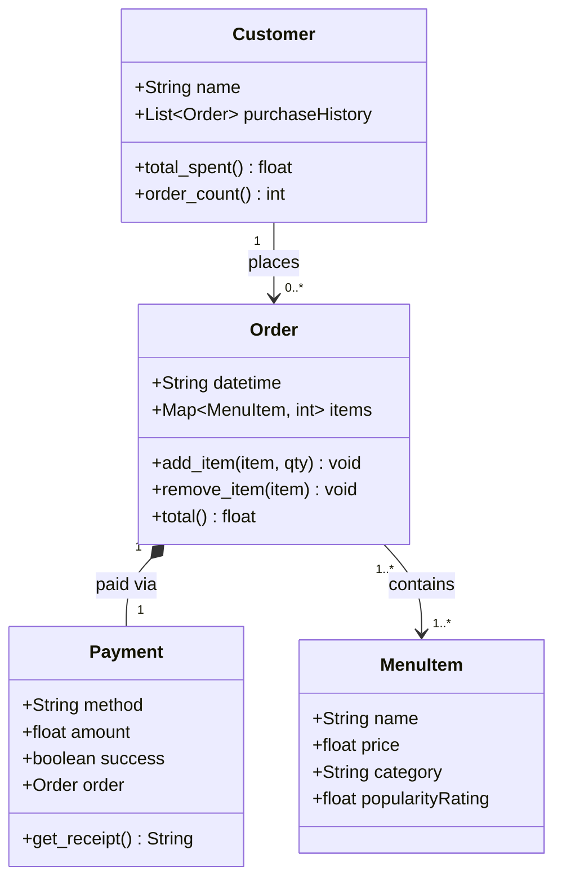

# ByteBites

A simple backend system for managing a food ordering app. Tracks customers, menu items, orders, and payments.

---

## Classes

| Class | Purpose |
|---|---|
| `MenuItem` | A food or drink item with a name, price, category, and popularity rating |
| `Customer` | A user who places orders; tracks purchase history |
| `Order` | A collection of menu items with quantities and a computed total |
| `Payment` | Records how an order was paid and whether it succeeded |

---

## UML Class Diagram

---

## Relationships

| From | To | Type | Description |
|---|---|---|---|
| Customer | Order | Association | A customer places zero or more orders |
| Order | MenuItem | Association | An order holds one or more items |
| Order | Payment | Composition | Every order is settled by exactly one payment |

---

## Files

- [models.py](models.py) — class definitions and menu helper functions
- [bytebites_spec.md](bytebites_spec.md) — original client feature requirements
- [bytebites_design.md](bytebites_design.md) — full UML diagram and relationship notes
- [test_bytebites.py](test_bytebites.py) — validated tests
