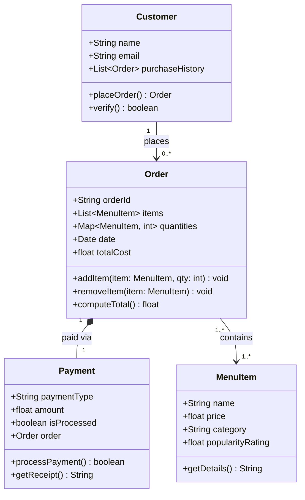

## Revised UML Class Diagram

### Multiplicity Key

| Symbol | Meaning |
|---|---|
| `1` | exactly one |
| `0..*` | zero or more |
| `1..*` | one or more |

### Relationship Notes

| Relationship | Type | Multiplicity | Description |
|---|---|---|---|
| Customer → Order | Association | 1 to 0..* | A customer places zero or more orders; each order belongs to one customer |
| Order → MenuItem | Association | 1..* to 1..* | An order holds one or more items; the same item can appear in many orders |
| Order → Payment | Composition | 1 to 1 | Every order is settled by exactly one payment; payment cannot exist without its order |

### Changes from Draft

- `Order` gains `orderId` (unique transaction identifier)
- `Payment` gains a back-reference to its `Order` to support receipt/lookup flows
- Multiplicity notation tightened to Mermaid-standard (`0..*`, `1..*`) instead of plain English labels
