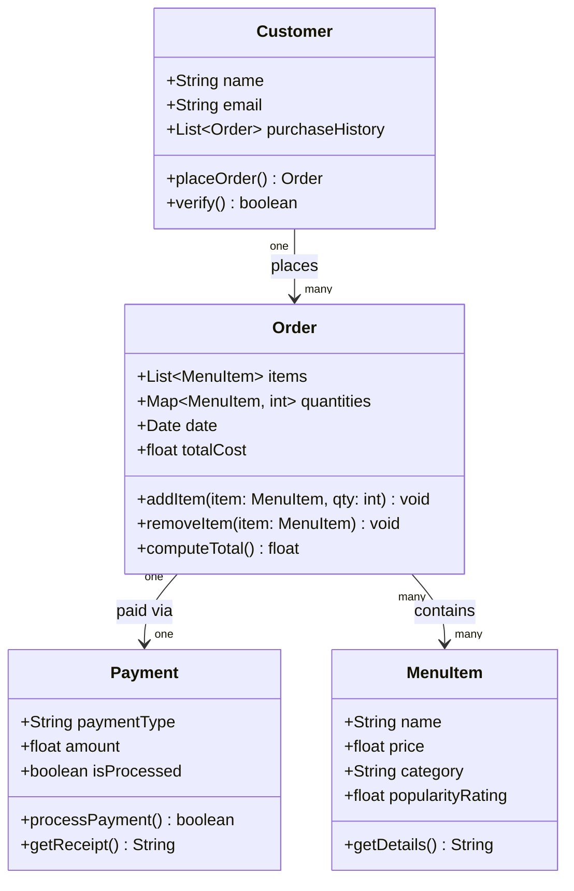

## UML Class Diagram

### Relationship Notes

| Relationship | Type | Multiplicity | Description |
|---|---|---|---|
| Customer → Order | Association | One-to-Many | A customer places zero or more orders; each order belongs to one customer |
| Order → MenuItem | Association | Many-to-Many | An order holds one or more items; the same item can appear in many orders |
| Order → Payment | Composition | One-to-One | Every order is settled by exactly one payment; payment cannot exist without its order |
